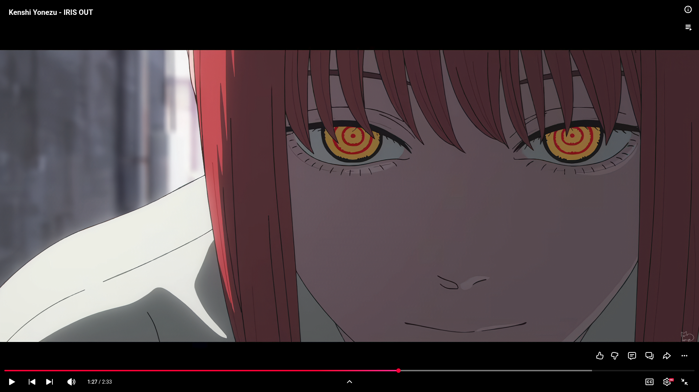
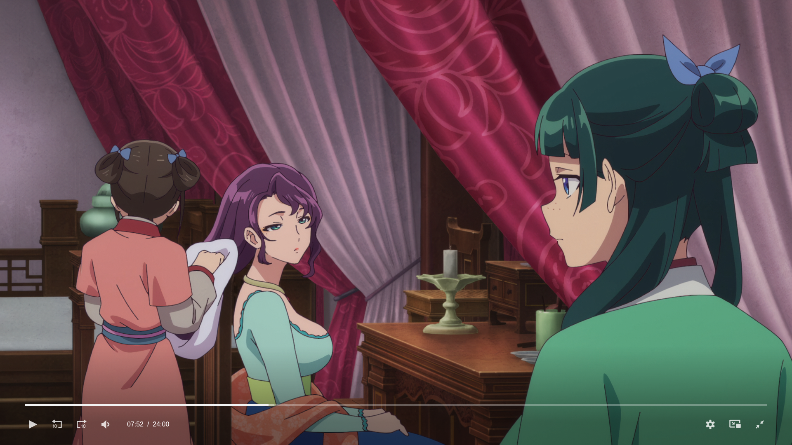

# NVIDIA RTX VSR on Linux

Experimental NVIDIA RTX Video Super Resolution integration for Chromium and Brave on Linux.
Locally tested on CachyOS/Wayland with an RTX 4070 SUPER.
See [Brave build and run instructions](docs/brave.md).

**Experimental preview:** the tested working mode reports **GPU sandbox inactive**.
Use it for isolated evaluation, not everyday browsing. Renderer sandbox status is
separate. NVIDIA libraries and models are not included.

## Screenshots — 1080p → 4K

1080p video processed at 3840×2160, then displayed on a 1920×1080 monitor.
These screenshots are captured at display resolution. Click an image to view full size.

**YouTube**

[](docs/screenshots/youtube-1080p-to-4k.png)

**Anime player**

[](docs/screenshots/anime-1080p-to-4k.png)

## Install the preview

Download the Linux archive and checksum from [Releases](https://github.com/caduHD4/linux-nvidia-rtx-vsr/releases).
Install the NVIDIA SDK below, then extract the browser archive and run:

```bash
python3 install.py --sdk "$HOME/.local/opt/nvidia-vfx/VideoFX"
```

Open **Chromium RTX VSR (Experimental)** from your app menu. No browser build or
root access is needed. See [installation details](docs/distribution.md).

## Requirements

- Linux x86_64, an NVIDIA RTX GPU, and a working driver (`nvidia-smi`).
- NVIDIA Video Effects SDK Core **1.3.0.0** and **nvvfxvideosuperres 1.3.0.0**.
- Wayland, Python 3.11+, and `libva-nvidia-driver` for the preview.
- For building: CMake 3.25+, a C++20 compiler, and Chromium build dependencies.

## Install the NVIDIA SDK

1. Sign in to [NGC](https://ngc.nvidia.com/) and download **1.3.0.0_linux** from
   [Video Effects SDK Core](https://catalog.ngc.nvidia.com/orgs/nvidia/maxine/resources/vfx_sdk_core/-).
   Access may require joining the Developer Program or an appropriate entitlement.
2. Extract the archive using Bash. Replace the filename below with your download:

```bash
mkdir -p "$HOME/.local/opt/nvidia-vfx"
tar -xf "$HOME/Downloads/VFXSDK_linux_1.3.0.0.tgz" -C "$HOME/.local/opt/nvidia-vfx"
export VFXSDK_ROOT="$HOME/.local/opt/nvidia-vfx/VideoFX"
```

`VFXSDK_ROOT` must contain `include`, `lib`, `external`, and `features`.
Keep the bundled dependencies and directory structure intact.

3. Create a Personal API Key with NGC Catalog access in **Account Settings → API Keys**.
   Install the feature with the SDK's official script:

```bash
read -r -s -p 'NGC API key: ' NGC_CLI_API_KEY
printf '\n'
export NGC_CLI_API_KEY
(
  cd "$VFXSDK_ROOT/features" || exit 1
  bash ./install_feature.sh -f nvvfxvideosuperres -v 1.3.0.0
)
unset NGC_CLI_API_KEY
```

The script detects your GPU architecture. No `sudo` is needed for this user-owned
installation. Never share your API key. For access errors, check your account
permissions and key scopes. See [NVIDIA's installation guide](https://docs.nvidia.com/maxine/vfx/latest/LinuxVFXSDK/InstalltheVFXSDK.html).

## Build

For Chromium setup, patches, and build instructions, see
[the development handoff](docs/CLOUD_HANDOFF.md).
Set `VFXSDK_ROOT` to your absolute `VideoFX` directory at build or launch time.
See [preview installation and packaging](docs/distribution.md) for the installer.

To build and test the standalone GPU backend:

```bash
cmake -S . -B build/gpu -DCMAKE_BUILD_TYPE=Release -DVFXSDK_ROOT="$VFXSDK_ROOT"
cmake --build build/gpu --parallel 2
ctest --test-dir build/gpu -L gpu --output-on-failure
```

## Status and licensing

Local playback supports fullscreen-only enhancement and up to 4K output.
Protected and HDR content bypass processing. Other GPUs and distributions still
need validation. Working local playback previously reported `sandboxed=false`.
The current sandbox-enabled probe applies seccomp to every GPU thread, but NVIDIA
NGX feature discovery fails (`-14`); the SDK uses parent-relative paths rejected
by Chromium’s file broker. This preview therefore uses the locally tested path;
fully sandboxed enhancement is unfinished. No sandbox-disabling flags or ANGLE
check removals are included.

NVIDIA libraries and models are downloaded separately. Redistribution depends on
[NVIDIA's license terms](https://www.nvidia.com/en-us/agreements/enterprise-software/product-specific-terms-for-ai-products/)
and how the SDK was obtained; Developer Program access has specific restrictions.
This is an independent experiment, not an NVIDIA-supported desktop integration.
