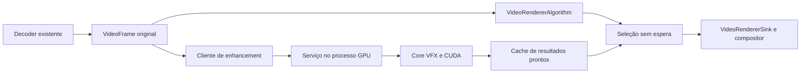

# Integração experimental NVIDIA VSR no Chromium Linux

Data: 2026-10-05. Estado: aprovado pelo usuário em 2026-10-05; execução integral autorizada, sem novas confirmações.

## Objetivo e decisões recebidas

Integrar o VideoSuperRes do NVIDIA Video Effects SDK no playback HTML5 do Chromium, com frames GPU e fallback transparente. Portar ao Brave depois de validar Chromium. Priorizar qualidade máxima: upscaling VSR_ULTRA (4), denoise nativo DENOISE_ULTRA (11), strength 1.0. Monitor de referência 1920x1080 a 180 Hz; executar uma vez por frame de vídeo elegível, nunca por refresh do monitor. Nenhum frame protegido pode entrar no processamento.

O pedido atual substitui a ordem antiga que priorizava GStreamer/mpv. Esses adapters, Vulkan, HDR e outros players ficam fora desta entrega. O core continua reutilizável. Sem proxy, captura, reencode, Python no playback ou transporte de pixels por IPC.

“Semelhante ao máximo do Windows” é objetivo de experiência e qualidade, não afirmação de equivalência entre o SDK Linux e o filtro integrado ao driver Windows. O modo 11 permanece conforme solicitado; sua eficácia contra os artefatos do material real será avaliada em A/B.

## Inspeção e evidências

- Repositório principal: `/home/caduhd4/Downloads/linux-nvidia`, main em `bf19880`; `.sdk/` aparece como untracked nessa branch. Não adicionar o SDK ao Git.
- Worktree de implementação: `.worktrees/m0-m1-vfx-smoke`, branch `feature/m0-m1-vfx-smoke`, HEAD `b8d989e53f6457ea71fe457145d23de0ded70eaa`, sem alterações locais.
- Foram lidos os arquivos versionados de código, headers, CMake, fixtures, testes, scripts, README, status, spec e plano M0/M1, além do plano original da área de trabalho e dos headers locais relevantes do SDK.
- SDK Core e feature 1.3.0.0 presentes em `.sdk/VideoFX`; headers oficiais disponíveis, inclusive CUDA Driver API em `external/cuda/include`.
- Logs anteriores: CPU CTest 3/3; GPU-build CTest 4/4. Apenas um dos quatro testes desse build executa VFX na GPU; os demais são testes CPU/discovery. Esse smoke usou HIGH (3), 1080p -> 2160p, e registrou 14.5241 ms/frame. `docs/status.md` registra outra execução a 13.5361 ms/frame. Nenhum desses tempos prova o custo de modo 4 em 720p -> 1080p ou modo 11 nativo.
- Nesta sessão: Python 6/6 passou com `python -B -m unittest discover -s tests/python -v`; os binários CPU `smoke_config_test` e `vfx_session_test` encerraram individualmente com código 0. Discovery CMake não foi reexecutado porque seu script escreve no worktree em Downloads.
- Reexecução do smoke GPU retornou código 1, status VFX -1100 em criação de stream, “no CUDA-capable device is detected”. Isso é uma limitação observada desta execução; não invalida nem revalida o resultado anterior na máquina host. A causa não foi diagnosticada nesta etapa.
- `df` confirma `/dev/nvme1n1p6` montado em `/home/caduhd4/Builds/brave`, aproximadamente 147 GiB disponíveis. Nenhuma operação em partições realizada.

M1 é um diagnóstico com imagem sintética persistente. `SmokeConfig` aceita somente modos 1–4 e exige aumento nas duas dimensões; não comporta denoise nativo. `VfxSession::Run` recria recursos por benchmark, mede média com sincronização e não recebe frames externos. A interface usa handles opacos e não representa pitch, formato, device/context, evento de conclusão ou ownership. Reutilizar a experiência e chamadas oficiais, sem transformar o smoke diretamente em API de playback.

Os mocks verificam aquisição, falhas e liberação de handles; não simulam kernels pendentes nem hazard GL/CUDA. O core precisa garantir conclusão dos comandos antes de destruir ou reutilizar imagens, inclusive em falha após um enqueue parcial.

## Alternativas e escolha

| Alternativa | Vantagem | Custo ou limite |
|---|---|---|
| Serviço GPU assíncrono, original no scheduler e resultado opcional na apresentação — recomendada | Mantém os deadlines e cobre decoders que entregam SharedImage compatível | Novo IPC de controle, cache de resultados e ponte de recursos |
| Pós-processar a saída de MojoVideoDecoderService antes de entregá-la | Ponto próximo ao decoder e recursos hardware | Nem todo decoder vive no processo GPU; precisa propagar alvo/deadline e pode atrasar entrega de todos os frames |
| Rodar efeito em VideoResourceUpdater/VideoLayerImpl durante composição | Conhece escala final | Está perto demais do deadline; repetir trabalho por refresh e bloquear composição são riscos maiores |

A escolha é uma proposta arquitetural baseada no código upstream consultado. Viabilidade do backing e interop ainda precisa de probe no build fixado, antes de habilitar o efeito em vídeos reais.

## Ponto do pipeline e componentes

1. `NvidiaVsrFrameClient`, no renderer/media sequence: observa frames aceitos em `AddReadyFrame_Locked`, mantém geração e IDs, faz admissão e IPC assíncrono. O original entra imediatamente na fila existente. Não usar `SetPrepareCB` como uma barreira que espera VSR: isso atrasaria a entrega do original.
2. `NvidiaVsrPresentationCache`: cache limitado de resultados completos. Em `VideoRendererImpl::Render`, depois de o algoritmo escolher o original, consulta o resultado correspondente e retorna original ou processado. `PaintFirstFrame` também usa a mesma política. Apenas lookup e referências sob o lock; IPC, callbacks e trabalho GPU acontecem fora dele.
3. `NvidiaVsrGpuService`, associado ao GPU channel/command buffer autorizado: valida recursos, faz ponte SharedImage, gerencia leases e comunica conclusão. O renderer nunca recebe texture IDs GL de serviço nem ponteiros CUDA.
4. `VsrProcessor`, core C++ independente do Chromium: loader dinâmico, efeito, buffers persistentes, CUDA stream/eventos, configuração e métricas. Sem Blink, Mojo ou cc na sua API.

Arquivos candidatos existentes: `media/renderers/video_renderer_impl.{h,cc}`, `media/base/media_switches.{h,cc}`, `gpu/ipc/{common,service,client}` e infraestrutura SharedImage. Novos adapters em `media/renderers/nvidia_vsr_*` e serviço GPU correspondente; backend compartilhado em alvo separado compilado pelo GN. Localização exata do receiver precisa obedecer dependências do revision fixado; não criar ciclo `//gpu` -> `//media/renderers`.

A cobertura inicial é playback pelo `VideoRendererImpl` com SharedImage GPU compatível. WebRTC, WebCodecs, captura, canvas e decoders exclusivamente CPU não estão garantidos por esse hook. O decoder existente e sua seleção continuam responsáveis pela decodificação; isto não adiciona NVDEC ao Chromium.

## Contratos de frame e IPC

Chave: `(session_id, stream_generation, frame_id, config_generation)`. `frame_id` deriva da identidade do frame aceito; PTS sozinho não é chave, pois seek e timestamps repetidos existem.

Requisição de controle: referência/export de ClientSharedImage conforme API do revision, acquire SyncToken, geometria, PTS/duração, color space, modo/strength e identificadores. Não serializar pixels. Recursos só podem pertencer ao channel autorizado; um mailbox recebido não implica permissão para acessar qualquer backing.

Resposta: resultado exportável ClientSharedImage/descritor correspondente, token de produção, geometria/color space, ID da requisição, status e tempos agregáveis. `VideoFrame::WrapSharedImage` encapsula a saída com release callback; lease só retorna ao pool depois do último consumidor e do release SyncToken. Imports/exports e contagem de referências devem seguir a API da revisão, não raw mailbox sem lifetime.

Core: `CudaFrameView` com device/context explícitos, ponteiro device, width/height, pitch, formato e lifetime externo; `ProcessorConfig` com entrada/saída, modo e strength; `Submit` e consulta assíncrona de conclusão com CUevent. Erros viram status, não exceções cruzando a ABI do adapter. Usar headers oficiais, sem reconstruir ABI NVIDIA.

## Formatos, geometria e cor

MVP: vídeo opaco SDR 8-bit, GPU SharedImage NV12 ou RGBA/BGRA amostrável. P010, RGB10A2, HDR/PQ/HLG, interlaced, alpha/transparência e color space desconhecido fazem bypass. Formatos incompatíveis são contabilizados; não reduzir 10-bit para 8-bit silenciosamente.

Recortar `visible_rect`, desconsiderando padding de `coded_size`. Inicialmente pixels quadrados e sem transformação especial; rotação, espelhamento e pixel aspect ratio não unitário fazem bypass até teste dedicado. Manter o tamanho natural do vídeo para layout; saída tem novo coded_size e visible_rect completo.

Converter NV12 para RGBA8 numa passada GPU em resolução de entrada, usando matriz/range/transfer/chroma siting explícitos. Não upscale antes do SDK. Reutilizar a matemática e convenções de cor do Chromium quando aplicáveis; não assumir BT.709 limited para todo vídeo. Saída RGB usa primárias/transfer coerentes, matriz RGB e range full. Não copiar metadata YUV ou flags de overlay para o novo RGB sem adaptação.

Para RGBA/BGRA, copiar para staging privado; normalizar ordenação dos canais para o contrato RGBA8 do core. Alpha de vídeo opaco é 255. Golden patterns verificam UV, range, canais, crop, orientação e roundtrip.

O SDK aceita RGBA/BGRA GPU; modo 11 exige resolução idêntica. Os modos 4 e 11 e strength 1.0 foram conferidos na [documentação NVIDIA](https://docs.nvidia.com/maxine/vfx/latest/Filters/VideoSuperResolution.html). A documentação recomenda avaliar denoise no conteúdo real e não o recomenda para blocking/banding estruturado; o A/B determinará se ele satisfaz o objetivo visual solicitado.

## Seleção de alvo e níveis

Para o primeiro experimento, alvo explícito e fixo: caixa de 1920x1080, sem depender de novas mensagens de layout. É um teto do buffer, não uma instrução para alterar o tamanho do elemento HTML. Otimização posterior por viewport físico exige extensão própria, fora do MVP.

- Fonte abaixo do alvo: ajustar dentro da caixa preservando aspect ratio, sem esticar. Escolher modo 4 apenas quando a saída aumenta as dimensões. 1280x720 -> 1920x1080, 640x360 -> 1920x1080, vídeo vertical cabe pela altura.
- Fonte 1920x1080: modo 11, saída 1920x1080, inclusive quando o elemento HTML é menor.
- Fonte que não necessita upscale e cabe no teto: modo 11 em tamanho de entrada. Fonte acima do teto: bypass inicial; o compositor faz seu downscale habitual.
- Se o tamanho ajustado/arredondado ou a razão não for aceito pelo SDK: bypass com razão explícita; não inventar suporte a um scale factor.
- Não processar em 4K para reduzir depois a 1080p. Não aplicar VSR e denoise em cascata.

Feature `LinuxNvidiaVsr` desligada por padrão, buildflag Linux opt-in, parâmetros `profile=max`, `strength=1.0`, `target_width=1920`, `target_height=1080`. Feature separada `LinuxNvidiaVsrProbe` permite observação sem efeito. O toggle experimental invalida geração e cache; o próximo frame usa o estado escolhido.

Não reduzir qualidade automaticamente: o requisito atual é máximo. Sob carga, usar original e medir bypass. Perfil adaptativo 4->3->2 ou 11->10->9 seria uma decisão posterior explícita. Modos reservados e streaming 21/23 não fazem parte do experimento.

## OpenGL/CUDA e sequências

Não assumir DMA-BUF -> CUDA em RTX desktop. ANGLE pode expor objetos diferentes dos objetos OpenGL nativos; `GL_TEXTURE_EXTERNAL_OES` e texturas multiplanares do decoder não são recursos CUDA GL automaticamente registráveis.

Ponte recomendada:

1. Na sequência proprietária do backing original, agendar dependência do acquire SyncToken e abrir representação read-only. Converter/copiar GPU -> staging RGBA8 privado, GL_TEXTURE_2D, não multisample.
2. Fechar o acesso original após a conclusão segura da leitura e propagar o release token de leitura; o original pode continuar disponível ao compositor. Nunca mapear o original para escrita CUDA.
3. Staging/output pertencem ao serviço e usam contextos GL nativos com compartilhamento comprovado. Registrar recursos uma vez com `cuGraphicsGLRegisterImage`; não registrar todo frame. Validar dispositivo físico com `cuGLGetDevices` e device identity.
4. No worker GL/CUDA dedicado, após o fence do staging, mapear via `cuGraphicsMapResources`, obter CUarray e copiar para buffer RGBA8 pitched usando `cuMemcpy2DAsync`. Executar VFX, copiar saída linear para CUarray de saída e unmap. Cópias device-to-device são aceitas; CPU não lê pixels.
5. Após unmap completo e handoff GL válido, produzir uma saída SharedImage consumível pelo Chromium. Publicar somente depois da conclusão CUDA e do acesso de escrita/estado cleared resolvido.

`NvCVImage_MapResource` é marcado experimental nos headers locais, e seu comentário não estabelece uma ponte OpenGL Linux pronta. Usar CUDA Driver API oficial para registrar/mapear e buffers lineares NvCVImage para o efeito, sem preencher campos internos do SDK à mão.

Acessos ao backing original/fábrica ficam na sequência exigida pelo Chromium. O worker só recebe recursos privados com compartilhamento demonstrado; não criar uma representação do original em outra thread só porque o manager tem lock. O [SharedImageManager](https://raw.githubusercontent.com/chromium/chromium/main/gpu/command_buffer/service/shared_image/shared_image_manager.h) explicita essa restrição.

A ponte staging -> worker -> SharedImage final também precisa comprovar thread ownership, texture sharing e fences. Se o backend não oferecer esse contrato, o probe reprova essa combinação; não mover objetos arbitrariamente entre threads nem executar VFX bloqueante na thread GPU principal. Vulkan/opaque-FD não é substituto implícito: exigiria nova spec.

## Sincronização, scheduling e fallback

SyncToken Chromium não é CUevent. Há quatro fronteiras: produção do decoder, cópia GL para staging, trabalho CUDA com unmap e consumo/liberação da saída. Cada uma precisa de dependência real da API respectiva; enviar um token por IPC não sincroniza CUDA.

Usar dependências do scheduler GPU para tokens Chromium, fence GL para staging e CUevent para término CUDA. Consultas e esperas de interop ficam fora da thread de composição. `glFinish`, `cuCtxSynchronize` e espera bloqueante no compositor são proibidos. Uma espera exigida pelo interop só pode acontecer no worker privado, sem segurar locks do backing original.

Em `Render`, o algoritmo continua decidindo PTS e drop de frames originais. Se o resultado do mesmo ID já estiver completo no cache, apresentar processado; caso contrário apresentar original imediatamente. Nunca entregar ao compositor uma saída cuja inferência ainda esteja em curso. Não esperar até deadline_max: a consulta no momento de seleção é o corte conservador.

Fixar a escolha original/processado na primeira apresentação de cada ID, para evitar alternância visual entre refreshes do mesmo frame. Reutilizar essa escolha a 180 Hz sem novo `Run`. Primeiro frame e preroll podem aparecer originais enquanto o serviço inicializa. Em pause manter o frame escolhido; retomar não reprocessa o mesmo ID automaticamente.

Pool inicial de três slots por sessão, uma sessão VSR ativa por GPU no MVP, limite global de 256 MiB para buffers/texturas controlados pelo adapter. Memória interna do SDK é medida à parte e uma falha de alocação desativa VSR. Outra sessão faz bypass. Um job ativo e no máximo um aguardando; demais frames seguem originais. Não acumular todos os frames decodificados antecipadamente.

**Estado experimental em2026-10-06:** o pool de saídas do cliente passou para
cinco para dar margem à continuidade; os três slots privados do GPU service e
o máximo de dois jobs foram preservados. O bloqueio global de uma única sessão
foi removido numa rodada anterior; o limite global256MiB ainda não é imposto.
Consulte `docs/chromium-validation.md` para evidências e limitações atuais.

Slots passam por free -> staging -> CUDA -> ready -> leased -> free. Slots de geração antiga e jobs atrasados continuam ocupados até conclusão segura; nunca “cancelar” liberando memória de kernel em voo. Resultados não selecionados são devolvidos assim que descartados; resultados escolhidos só após callback de liberação e fence do último leitor. Pool cheio significa bypass, nunca espera para obter slot.

Queue timeout de 50 ms sem início faz bypass. Watchdog de 100 ms sem conclusão impede novas submissões e descarta publicação; não tenta interromper kernel, resetar contexto ou liberar buffers em uso. Se não houver conclusão segura, manter recursos em quarentena até teardown do processo. Erro fatal de CUDA/context loss torna o serviço indisponível; o cliente mantém original, mas não é possível prometer sobrevivência da renderização a uma falha fatal do processo GPU inteiro.

Seek/flush/reconfigure/toggle/GPU channel disconnect incrementam geração. Callbacks antigos são ignorados e leases drenados sem acesso a objetos destruídos. Não adicionar latência de áudio nem modificar time source. Reconfiguração cria estado VFX novo fora do hot path; `NvVFX_Load` uma vez por configuração, nunca por frame. Não supor seletor de reset temporal não documentado para VideoSuperRes.

## Runtime e sandbox

Compilar contra headers oficiais 1.3.0.0; carregar dinamicamente CUDA, VideoFX e NVCVImage, incluindo feature/transitive dependencies necessárias. O executável browser não deve depender do SDK na inicialização quando a feature está desligada. Paths de instalação confiáveis e versão verificada; ausência resulta em unavailable/bypass.

Usar backend local do SDK, não Triton/rede. Não executar `nvidia-smi` via subprocesso no processo GPU; obter identidade por APIs CUDA/GPUInfo. GL e CUDA têm de estar na mesma GPU física; índice 0 isolado não é prova.

Probe precisa validar sandbox GPU habilitado, acesso a bibliotecas/assets e device nodes. Se houver necessidade de preload antes do sandbox, fazer carregamento controlado quando opt-in e inicialização GPU no estágio apropriado. Não usar `--no-sandbox` como critério de aceite. Caso o SDK exija permissões não compatíveis com o sandbox, registrar impedimento concreto e rever o design antes do playback.

## Gates técnicos e aceite

O design está definido; as capacidades seguintes ainda não foram demonstradas. Nenhum gate pode ser marcado aprovado apenas por uma API existir no header.

| Gate | Evidência exigida | Se falhar |
|---|---|---|
| SDK no core | Modo 4 720p->1080p e modo 11 1080p->1080p, imagem válida, tempos p95/p99 | Corrigir core; Chromium permanece bypass |
| Recursos Chromium | Decoder efetivo, storage, formato, backing, GL target/usages, proteção e GPU identity | Marcar combinação unsupported |
| Ponte GL/CUDA | Pattern GPU -> staging -> CUDA -> saída -> compositor, pixels corretos, fences e sandbox | Rever ponte; não introduzir CPU readback |
| Scheduler | VFX lento/falha não bloqueia Render nem atrasa PTS original | Corrigir antes de habilitar playback |
| Qualidade e desempenho | A/B real, p95/p99 de ponta a ponta, contagens e VRAM estável | Bypass sob carga; reportar limites |

Testes CPU: política de modo/alvo, proteção antes de import, generations, timestamps repetidos, fallback antes/depois do corte, escolha fixa, pool esgotado, leases/release tokens, falhas parciais, reconfigure e SDK ausente. Mock deve modelar “ainda em voo”, não apenas contagem de handles.

Testes GPU do core: RGBA8/BGRA8, padrões de canais e imagem não preta, modo 4 em 360/480/720p->1080p, modo 11 1080p nativo, 10.000 frames, falhas/cancelamento/teardown, nenhuma alocação grande por frame após warm-up e eventos CUDA. Não usar apenas status de retorno como prova da imagem produzida.

Testes Chromium: HTML5 local e YouTube sem DRM em H.264/VP9/AV1 quando disponíveis, decoders hardware e software, X11/Wayland, fullscreen, janela, pause/seek, MSE troca de resolução, toggle, perda de GPU channel e dois vídeos simultâneos. Decoder CPU/interop incompatível deve fazer bypass observável. Testes negativos P010/HDR/DRM verificam zero submissões ao SDK; não dependem de expor pixels protegidos.

Desempenho: 23.976/24/30/50/60 fps como faixa principal, 120 fps como stress com fallback permitido. A 60 fps o intervalo é 16.67 ms; medir custo completo de conversão+interop+VFX+publicação e impacto na apresentação. p95 abaixo desse intervalo é meta de throughput, não prova isolada de cumprir todo deadline. Registrar misses e frame drops comparando VSR OFF/ON. A 180 Hz medir que Run não cresce com refreshes.

Métricas agregadas: submitted/completed/presented, bypass por motivo, queue age, tempo interop/VFX/total p50/p95/p99, ocupação/VRAM e geração. `chrome://media-internals` e tracing para verificar atividade; nenhum log por frame por padrão. Overlay visual pode vir depois; não é necessário para validar.

## Sequência incremental após aprovação

Esta seção define gates e ordem, não substitui o plano executável com arquivos e comandos.

1. Extrair core mínimo e testar modos 4/11, loader, lifetime e eventos, mantendo smoke existente.
2. Fixar revisão Chromium e preparar checkout/build baseline na partição dedicada.
3. Implementar probe de recursos e gerar relatório real sem rodar VSR.
4. Validar ponte GL/CUDA com patterns e sandbox; começar com RGBA, depois NV12 SDR.
5. Conectar submissão assíncrona/cache/fallback, inicialmente desabilitado, com mock de atraso.
6. Habilitar core em HTML5 720p e 1080p e completar testes de cor, scheduling e estabilidade.
7. Validar mídia real e publicar limites observados; só então elaborar porte para a revisão Chromium usada pelo Brave.

O plano de implementação detalhado será escrito após aprovação desta spec, conforme pedido. Download/build/modificação Chromium só começam depois da aprovação aplicável.

## Armazenamento e estratégia de revisão

Todo checkout, depot_tools, download temporário e output Chromium/Brave ficará sob `/home/caduhd4/Builds/brave`. SDK permanece externo em Downloads, somente leitura. Primeiro um checkout Chromium e um output de desenvolvimento, sem segundo checkout Brave simultâneo.

147 GiB disponíveis excedem o mínimo documentado de 100 GB do Chromium, mas não garantem caber todo checkout/output e futuro Brave. Preferir fetch sem histórico, símbolos reduzidos e sem mirror/cache duplicado; medir `du`/`df` depois de cada estágio e manter reserva operacional de 20 GiB. Se a previsão de um estágio consumir a reserva, interromper antes desse estágio e rever artifacts/output. Não reparticionar nem apagar dados para ganhar espaço.

Fixar revisão exata antes do primeiro patch, registrar versão e GN args. As referências consultadas nesta sessão são upstream `main`, não uma promessa de APIs idênticas na futura base. Para Brave, portar patch série com base na versão que ele efetivamente usa; não decidir a versão pelo upstream latest.

Documento inicialmente salvo em Builds/brave por restrição da sessão anterior; copiado ao worktree após autorização e liberação de acesso. Destino pretendido após haver workspace gravável do projeto: `docs/specs/2026-10-05-chromium-nvidia-vsr-design.md`.

## Referências verificadas

- [VideoRendererImpl: aceitação, seleção e apresentação de frames](https://raw.githubusercontent.com/chromium/chromium/main/media/renderers/video_renderer_impl.cc).
- [VideoFrame: SharedImage, geometria e release callback](https://raw.githubusercontent.com/chromium/chromium/main/media/base/video_frame.h).
- [Metadata de proteção](https://raw.githubusercontent.com/chromium/chromium/main/media/base/video_frame_metadata.h).
- [SharedImage representations e acesso scoped](https://raw.githubusercontent.com/chromium/chromium/main/gpu/command_buffer/service/shared_image/shared_image_representation.h).
- [GpuChannel: scheduler, sync points e context share group](https://raw.githubusercontent.com/chromium/chromium/main/gpu/ipc/service/gpu_channel.h).
- [MojoVideoDecoderService: processo GPU ou utility e recursos externos](https://chromium.googlesource.com/chromium/src/+/main/media/mojo/services/mojo_video_decoder_service.cc).
- [CUDA OpenGL interop](https://docs.nvidia.com/cuda/cuda-driver-api/cuda_driver_api/group__CUDA__GL.html) e [graphics map/unmap](https://docs.nvidia.com/cuda/cuda-driver-api/cuda_driver_api/group__CUDA__GRAPHICS.html).
- [VFX API: load, async Run e CUDA stream](https://docs.nvidia.com/maxine/vfx/latest/API/Reference/VideoEffectsFunctions.html).
- [Build Chromium Linux: disco, dependências e checkout](https://chromium.googlesource.com/chromium/src/+/main/docs/linux/build_instructions.md).
- Fontes locais: `docs/status.md`, spec/plano M0/M1, `nvCVImage.h`, `nvVideoEffects.h`, `nvVFXVideoSuperRes.h` e Changelog 1.3.0.
